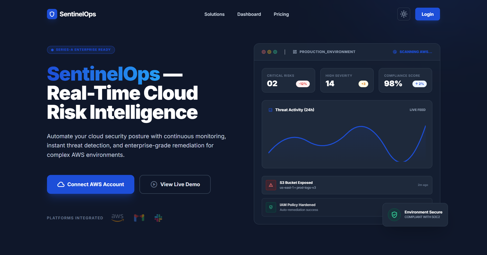
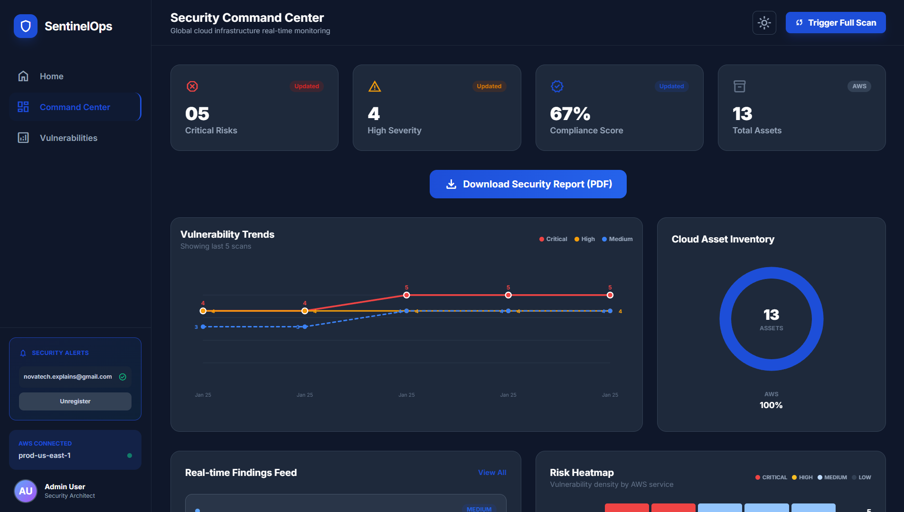
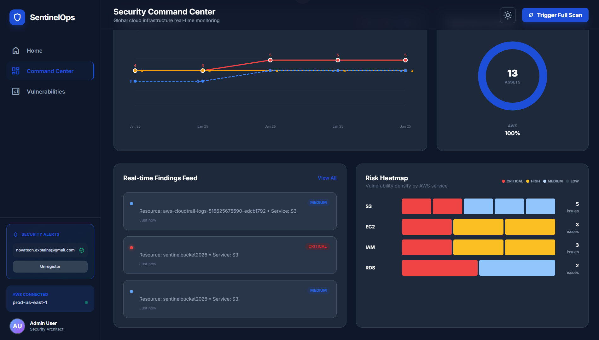
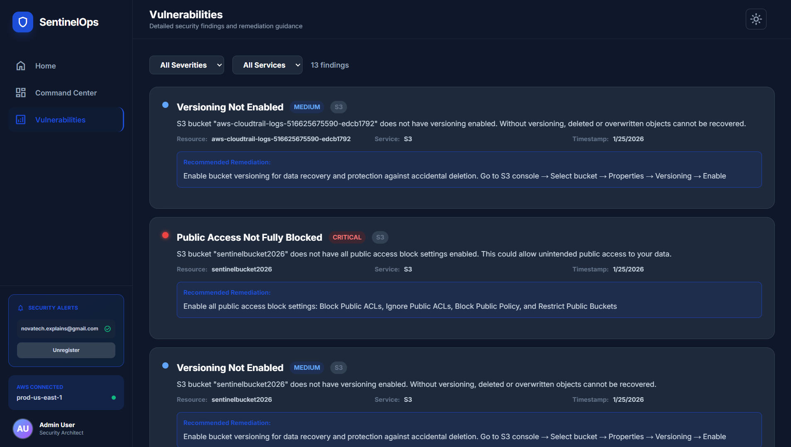
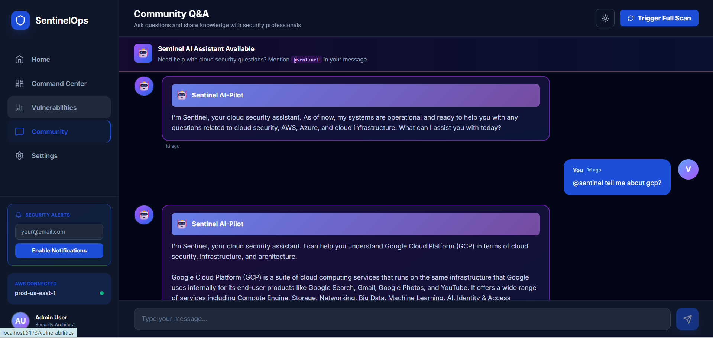
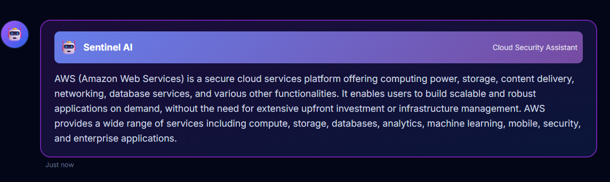
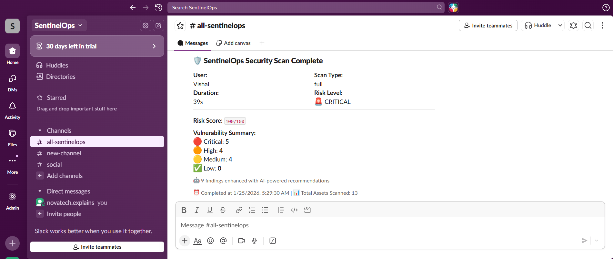
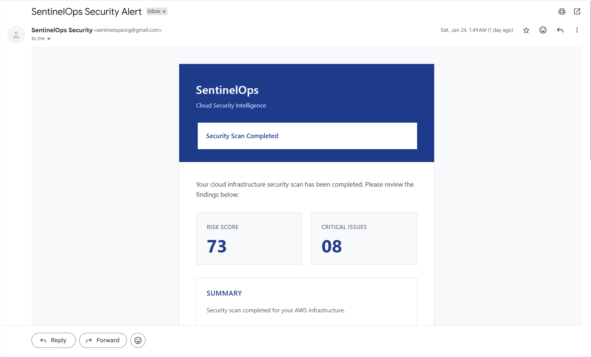
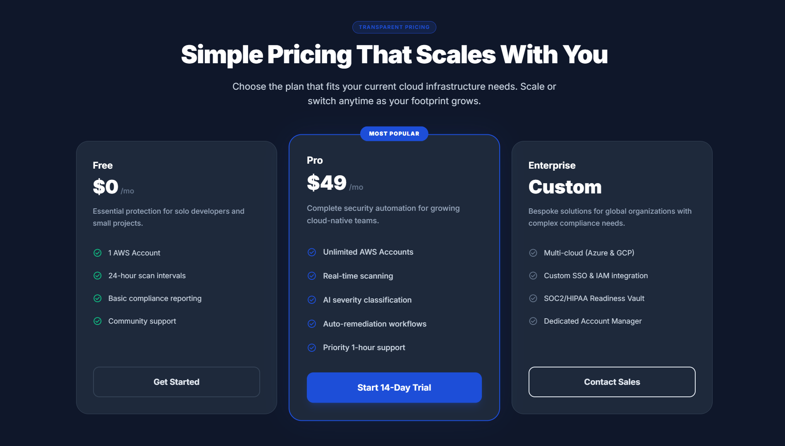

# SentinelOps

## Overview

SentinelOps is an enterprise-grade, multi-cloud security posture management platform designed to provide real-time vulnerability assessment, compliance monitoring, and security threat detection across AWS, Azure, and Google Cloud Platform infrastructures. Built with a microservices architecture, the platform combines automated security scanning with AI-powered analysis to deliver actionable insights for cloud security teams.

Organizations operating in multi-cloud environments face significant challenges in maintaining comprehensive security visibility and compliance. SentinelOps addresses these challenges by providing unified multi-cloud visibility, automated security scanning with AI-enhanced reporting, real-time alerting via Slack and email, compliance monitoring, and a collaborative security platform with AI-powered assistance.

## Demo

### Application Screenshots

The following screenshots demonstrate the key features and user interface of SentinelOps:

#### Landing Page


#### Security Dashboard




#### Vulnerability Management


#### Community Platform




#### Notification System




#### Pricing Plans


### Video Demonstration

A comprehensive video demonstration showcasing the complete workflow, features, and capabilities of SentinelOps is available:

**[View Demo Video](demo/Project_demo.mp4)**

The demo video covers:
- User authentication and onboarding
- Cloud account configuration
- Security scan execution across multiple cloud providers
- Vulnerability analysis and prioritization
- Report generation and distribution
- Community platform features
- AI-powered assistance

## Key Features

### Multi-Cloud Security Scanning

- **AWS Security Scanner**: Comprehensive scanning of S3 buckets, EC2 security groups, IAM policies, RDS databases, and Lambda functions for misconfigurations and security vulnerabilities.

- **Azure Security Scanner**: Assessment of storage accounts, virtual machines, network security groups, role assignments, and resource locks.

- **GCP Security Scanner**: Evaluation of Cloud Storage buckets, Compute Engine instances, IAM policies, and service accounts.

### Vulnerability Management

- Severity-based classification (Critical, High, Medium, Low)
- Risk score calculation based on vulnerability impact
- Detailed remediation guidance for each finding
- Historical trend analysis for tracking security improvements

### AI-Powered Analysis

- **Executive Summaries**: AI-generated security overviews for stakeholders
- **Contextual Remediation**: Step-by-step remediation instructions with business context
- **Community AI Assistant**: Cloud security-focused chatbot (Sentinel) for instant answers to security questions

### Reporting and Notifications

- **PDF Report Generation**: Professional security assessment reports with comprehensive findings
- **Email Integration**: Automated email delivery of security reports via EmailJS
- **Slack Integration**: Real-time vulnerability notifications with formatted alerts
- **Scan History**: Complete audit trail of all security scans with timestamps

### Security Asset Management

- Multi-account support for each cloud provider
- Secure credential management
- Role-based access control
- Scan history and audit logs

## Core Objectives

1. **Unified Multi-Cloud Visibility**: Centralized dashboard for monitoring security posture across AWS, Azure, and GCP from a single interface.

2. **Automated Security Scanning**: Continuous assessment of cloud resources including storage services, compute instances, network configurations, and identity management systems.

3. **AI-Enhanced Reporting**: Integration with Mistral AI for generating executive summaries, detailed remediation steps, and business impact analysis.

4. **Real-Time Alerting**: Instant notifications via Slack and email when critical vulnerabilities are detected.

5. **Compliance Monitoring**: Automated checks against industry security standards and best practices.

6. **Collaborative Security**: Built-in community platform with AI-powered assistance for security teams to share insights and best practices.

## Architecture

SentinelOps employs a modern microservices architecture with clear separation of concerns:

```
┌─────────────────────────────────────────────────────────────┐
│                        Frontend Layer                        │
│                  React + Vite + TailwindCSS                  │
│         (Dashboard, Vulnerability View, Community)           │
└────────────────────────┬────────────────────────────────────┘
                         │
                         ↓
┌─────────────────────────────────────────────────────────────┐
│                     Node.js Backend (Express)                 │
│                                                              │
│  • Authentication & Authorization (JWT)                      │
│  • User Management (MongoDB)                                 │
│  • Cloud Account Management (AWS/Azure/GCP)                  │
│  • Scan History & Persistence                                │
│  • Community Platform                                        │
│  • Slack Notification Service                                │
└────────────────────────┬────────────────────────────────────┘
                         │
                         ↓
┌─────────────────────────────────────────────────────────────┐
│                     Python Backend (Flask)                    │
│                                                              │
│  • AWS Security Scanner (boto3)                              │
│  • Azure Security Scanner (Azure SDK)                        │
│  • GCP Security Scanner (Google Cloud SDK)                   │
│  • AI Enhancement Engine (Mistral)                           │
│  • PDF Report Generator (ReportLab)                          │
└─────────────────────────────────────────────────────────────┘
```

### Component Breakdown

**Frontend (React)**
- Modern, responsive UI built with React 19 and TailwindCSS
- Real-time scan progress visualization
- Interactive vulnerability dashboard with filtering and sorting
- Dark mode support
- Protected routes with JWT authentication

**Node.js Backend**
- RESTful API design with Express.js
- MongoDB for persistent data storage (users, scans, community messages)
- JWT-based authentication and authorization
- Integration with external notification services (Slack, EmailJS)
- Community chat platform with AI assistance

**Python Backend**
- Flask-based microservice for security scanning operations
- Cloud SDK integrations (AWS boto3, Azure SDK, Google Cloud SDK)
- Mistral AI integration for enhanced vulnerability analysis
- PDF generation engine for professional reports
- Asynchronous scanning with progress tracking

## Technology Stack

### Frontend
- **Framework**: React 19.2.0
- **Build Tool**: Vite with Rolldown
- **Styling**: TailwindCSS 3.4
- **Routing**: React Router DOM 7.12
- **HTTP Client**: Axios 1.13
- **UI Components**: Lucide React (icons)
- **Email Service**: EmailJS Browser 4.4
- **State Management**: React Context API

### Backend (Node.js)
- **Runtime**: Node.js
- **Framework**: Express 4.18
- **Database**: MongoDB with Mongoose ODM 8.0
- **Authentication**: JWT (jsonwebtoken 9.0)
- **Password Hashing**: bcryptjs 2.4
- **Cloud SDKs**: AWS SDK 2.16
- **Validation**: Express Validator 7.0
- **CORS**: cors 2.8

### Backend (Python)
- **Framework**: Flask with Flask-CORS
- *
```bash
# Install MongoDB (Windows)
# Download from https://www.mongodb.com/try/download/community

# Start MongoDB service
# Windows: MongoDB should start automatically as a service
# macOS: brew services start mongodb-community
# Linux: sudo systemctl start mongod

# Verify MongoDB is running
mongosh
```

## Configuration

### Cloud Provider Credentials

SentinelOps requires cloud provider credentials to perform security scans. Credentials are provided per-scan and not stored permanently.

**AWS Requirements:**
- AWS Access Key ID
- AWS Secret Access Key
- AWS Region

**Azure Requirements:**
- Subscription ID
- Tenant ID
- Client ID
- Client Secret

**GCP Requirements:**
- Service Account JSON file or credentials

### Optional Integrations

**Slack Notifications:**
Set `SLACK_WEBHOOK_URL` in Node.js backend `.env` file.

**Email Reports:**
Configure EmailJS credentials in frontend application.

**AI Enhancement:**
Install Ollama and pull Mistral model for AI-powered analysis:
```bash
# Install Ollama
# Windows: Download from https://ollama.ai

# Pull Mistral model
ollama pull mistral
```

## Usage

1. **Register/Login**: Create an account or log in to the platform
2. **Add Cloud Account**: Navigate to Settings and add your cloud provider credentials
3. **Run Security Scan**: Select cloud provider and initiate scan from Dashboard
4. **Review Results**: Analyze vulnerabilities categorized by severity
5. **Download Reports**: Export comprehensive PDF reports
6. **Configure Alerts**: Set up Slack/Email notifications for critical findings
7. **Community Collaboration**: Use the Community page to discuss security topics with AI assistance

## Demo

### Application Screenshots

The following screenshots demonstrate the key features and user interface of SentinelOps:

#### Landing Page

*Professional landing page with feature overview and call-to-action*

#### Security Dashboard

*Comprehensive security metrics and vulnerability distribution*


*Real-time scan results with severity-based categorization*

#### Vulnerability Management

*Detailed vulnerability listing with remediation guidance*

#### Community Platform

*Collaborative platform for security discussions*


*Sentinel AI assistant providing cloud security guidance*

#### Notification System

*Real-time Slack notifications for critical security findings*


*Automated email delivery of security assessment reports*

#### Pricing Plans

*Flexible pricing tiers for organizations of all sizes*

### Video Demonstration

A comprehensive video demonstration showcasing the complete workflow, features, and capabilities of SentinelOps is available:

**[View Demo Video](demo/Project_demo.mp4)**

The demo video covers:
- User authentication and onboarding
- Cloud account configuration
- Security scan execution across multiple cloud providers
- Vulnerability analysis and prioritization
- Report generation and distribution
- Community platform features
- AI-powered assistance

## Security and Privacy

- **Credential Security**: Cloud provider credentials are never stored permanently; they are used only for the duration of the scan
- **Authentication**: JWT-based authentication with bcrypt password hashing
- **Data Protection**: Scan results are stored securely in MongoDB with user-specific access control
- **API Security**: CORS configuration and request validation on all endpoints
- **Environment Isolation**: Sensitive configuration managed through environment variables

## Project Structure

```
sentinelops/
├── backend/
│   ├── nodejs/              # Express.js backend
│   │   ├── middleware/      # Authentication middleware
│   │   ├── models/          # MongoDB schemas
│   │   ├── routes/          # API endpoints
│   │   └── utils/           # Helper functions (Slack notifier)
│   └── python/              # Flask backend
│       ├── scanner.py       # AWS security scanner
│       ├── azure_scanner.py # Azure security scanner
│       ├── gcp_scanner.py   # GCP security scanner
│       ├── mistral_enhancer.py  # AI enhancement
│       ├── pdf_generator.py     # PDF report generation
│       └── app.py           # Flask application
├── frontend/                # React application.

## Usage

1. **Register/Login**: Create an account or log in to the platform
2. **Add Cloud Account**: Navigate to Settings and add your cloud provider credentials
3. **Run Security Scan**: Select cloud provider and initiate scan from Dashboard
4. **Review Results**: Analyze vulnerabilities categorized by severity
5. **Download Reports**: Export comprehensive PDF reports
6. **Configure Alerts**: Set up Slack/Email notifications for critical findings
7. **Community Collaboration**: Use the Community page to discuss security topics with AI